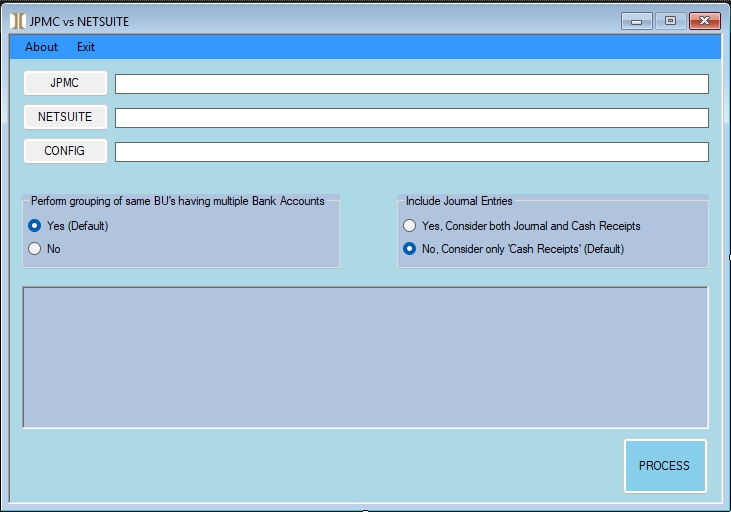

# 2025 - Bank Statement Comparator

**Built in:** 2025  
**Technology:** VB.NET (WinForms)

### Description
This VB.NET Windows application was developed to automate the reconciliation process between bank statements and internal revenue ledgers.

It compares:
- JPMorgan Chase bank statements (containing commission deposits from multiple organizations and carriers)
- NetSuite Revenue Ledger (manual ledger with more granular breakdown of lump-sum transactions)

### Key Functionality
- Automatically matches transactions between the two sources
- Uses two external mapping files:
  - Organization abbreviation mapping (JPMC full name → NetSuite 3-letter code)
  - Carrier name mapping (JPMC description → proper carrier name)
- Identifies matched, unmatched, and partially matched transactions
- Generates clear comparison reports for reconciliation

### Problem It Solved
Previously, comparing the bank statement with the NetSuite ledger was a highly manual and time-consuming process involving searching, cross-referencing abbreviations, and manually matching lump-sum deposits.

This tool significantly reduced manual effort and improved accuracy in commission deposit reconciliation.

### Technology
- VB.NET WinForms application
- Custom file parsing and matching logic
- Support for external mapping/configuration files

### Inputs Required
- JPMorgan Chase statement file
- NetSuite Revenue Ledger file
- Organization abbreviation mapping file
- Carrier name mapping file

### Screenshots

### Files
All source code is located in the `src/` folder.
