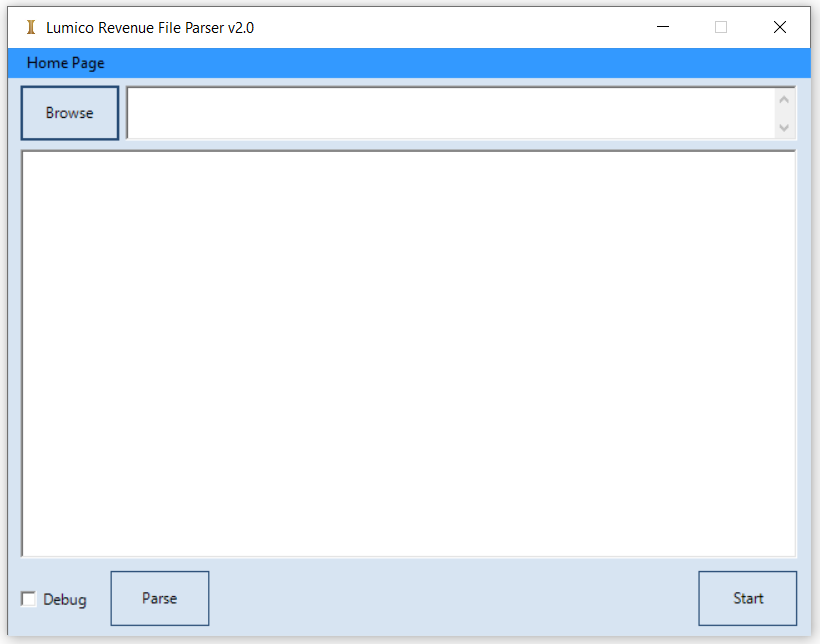
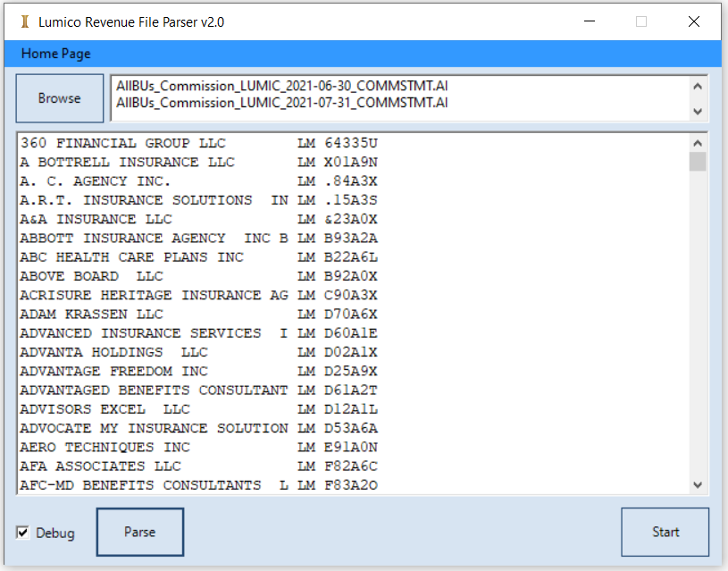
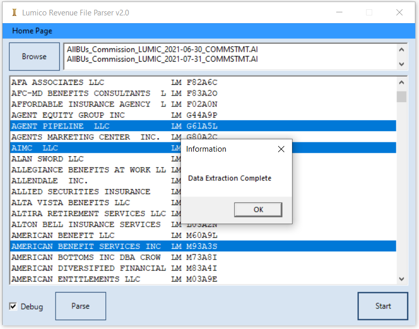

# Lumico & CSI Commission Statement Parser (2022)

**Built in:** 2022  
**Technology:** VB.NET (WinForms)

### Description
This VB.NET Windows application was developed to efficiently parse large commission statement text files containing data for 50–60 sub-organizations and agencies.

Previously, extracting specific organization/agency data required manually searching and copy-pasting sections from a very large text file. This tool automates the entire process.

### Key Functionality
- Parses large commission statement text files
- Displays all available organizations and agencies on screen
- Allows multiple selection of required orgs/agencies
- Extracts only the selected data with one click
- Generates clean output files for further processing

### Benefits
- Drastically reduced manual effort and time
- Eliminated error-prone copy-pasting
- Provided a user-friendly interface for selective data extraction

### Technology
- VB.NET WinForms application
- Custom text file parser with multi-selection capability

### Screenshots

### Files
All source code is located in the `src/` folder.

### Note
This tool was specifically built to handle commission statements for LUMICO and CSI insurance carriers.
