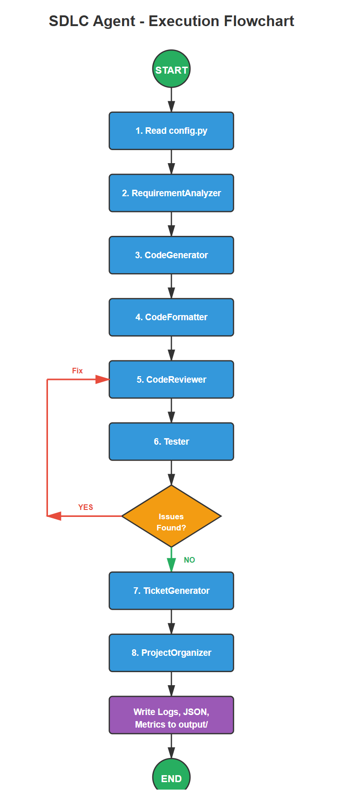
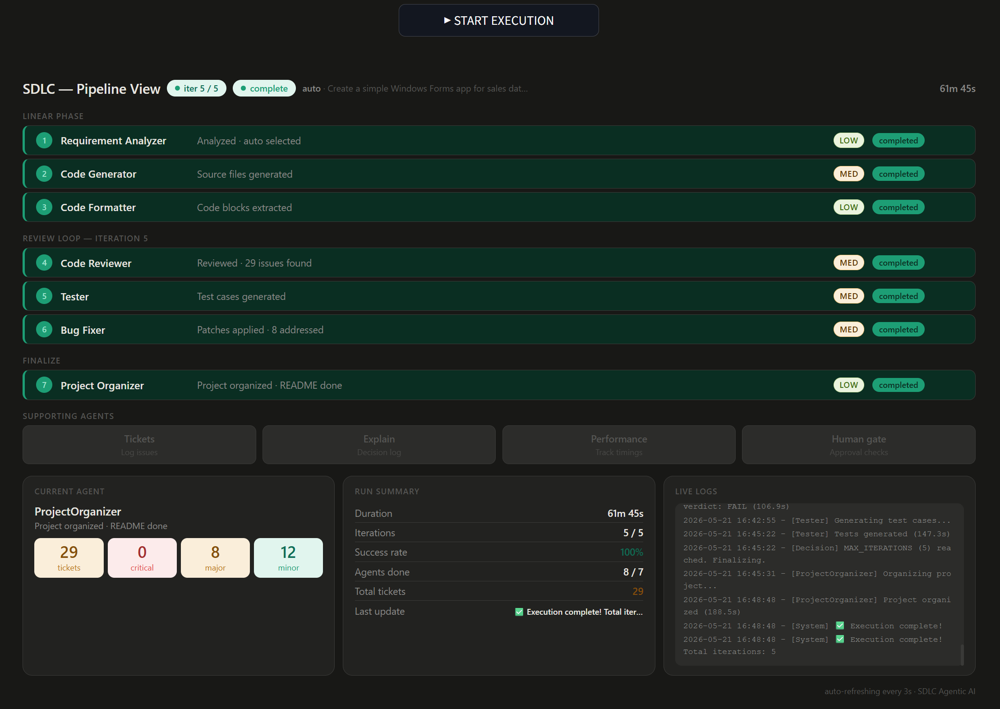

# Agentic SDLC Agent

A **fully local multi-agent system** that autonomously handles the full Software Development Life Cycle (SDLC) using LangGraph and local Ollama models.
Built and tested on a normal **Dell i5 laptop** — no cloud APIs, no Claude, no Copilot during execution.

---

## 🎯 Project Goal

To build an agentic system that can take a high-level requirement and autonomously:
- Analyze requirements
- Generate code
- Review code
- Test code
- Fix bugs
- Organize the final project

**Target Output**: A working VB.NET Windows Forms application (Sales Data Entry tool with CRUD functionality).

---

## 🛠 Tech Stack

- **Orchestration**: LangGraph (StateGraph with conditional edges)
- **LLMs**: Local Ollama models (Llama 3.2 3B + Gemma 2B)
- **UI/Dashboard**: Streamlit
- **Language Generated**: VB.NET Windows Forms
- **All components run 100% locally**

---

## ✨ Key Features

- **Multi-Agent Collaboration** with specialized roles
- **Human Intervention Gates** — System pauses for approval, rejection, or notes at critical steps
- **ExplainabilityAgent** — Logs reasoning behind every decision
- **Resilience Module** — Retry logic + Circuit Breaker to handle failures
- **Multiple LLMs Support** — Different models assigned to different agents
- **Self-Consistency Prompting** — Critical agents query LLM 3 times and summarize best response to reduce hallucinations
- **Live Streamlit Dashboard** for monitoring agent status and logs

---

## 🧪 Results

- Successfully generated a functional VB.NET Windows Forms application with CRUD, validation, and CSV support.
- System typically runs **8–15 review-test-fix cycles** per execution.
- Execution time: Several hours on a standard Dell i5 laptop.

**Note**: While the generated code is functional, it still requires manual review and improvements for production use.

---

## ⚠️ Challenges Faced

- Frequent hallucinations and infinite loops in agent cycles
- High latency and resource consumption on consumer hardware
- Safety risks with code execution (agents can potentially modify/delete files)
- Need for significant human supervision

**Dealing with hallucinations was fun!!** 😂

---

## 📌 Future Improvements

- Better long-term memory
- Stronger sandboxing for code execution
- Integration with GitHub / JIRA
- Fine-tuned enterprise LLM support
- More robust self-consistency and evaluation mechanisms

---

## 📝 Learnings

- This project taught me the real complexity and challenges of building reliable agentic systems — especially when running everything locally.
- It highlighted the importance of orchestration, resilience, human oversight, and the limitations of small local models.
- Built as a learning project to understand agentic AI deeply.

---

## Screenshots

