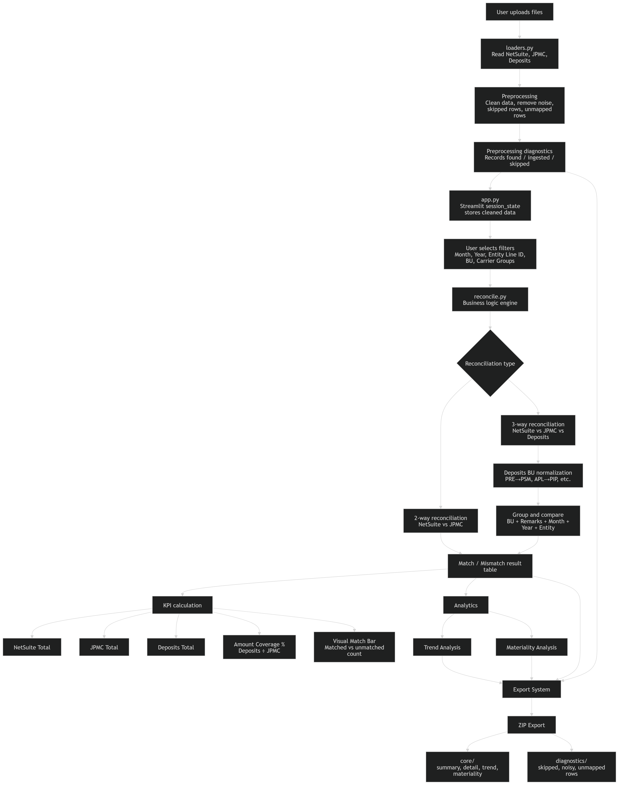

# 🚀 BU–CG Reconciliation Platform

## 📌 Overview

The BU–CG Reconciliation Platform is a Streamlit-based financial reconciliation and operational analytics application designed to reconcile and analyze transactional data across multiple enterprise financial sources.

The platform supports:

* 2-way reconciliation
* 3-way reconciliation
* preprocessing diagnostics
* reconciliation analytics
* trend analysis
* materiality analysis
* audit-friendly exports
* operational KPI monitoring

The application is currently designed for local operational finance workflows.

---

# 🏦 Core Data Sources

The platform reconciles data across:

| Source       | Purpose                        |
| ------------ | ------------------------------ |
| NetSuite     | Accounting / GL totals         |
| JPMC (Chase) | Banking transaction totals     |
| Deposits     | Operational deposit validation |

---

# ✨ Key Features

## 🔄 Reconciliation Engine

* NetSuite vs JPMC reconciliation
* NetSuite vs JPMC vs Deposits reconciliation
* match/mismatch classification
* operational exception handling

---

## 📊 KPI Dashboard

* NetSuite Total
* JPMC Total
* Deposits Total
* Amount Coverage %
* Visual Match Bar

---

## 🩺 Preprocessing Diagnostics

* records found
* records ingested
* records skipped
* noisy row detection
* unmapped row tracking

---

## 📈 Trend Analysis

* month-over-month analysis
* BU-level filtering
* entity filtering
* top carrier group analysis

---

## 💰 Materiality Analysis

* variance analysis
* operational anomaly review
* BU-level exception analysis

---

## 📦 Export System

Exports reconciliation packages into:

```text
core/
diagnostics/
```

Including:

* reconciliation summaries
* detailed outputs
* diagnostics logs
* skipped records
* unmapped records

---

# 🏗️ Architecture

```text
User Uploads Files
        ↓
Data Ingestion (loaders.py)
        ↓
Preprocessing & Diagnostics
        ↓
Session State Persistence
        ↓
Reconciliation Engine (reconcile.py)
        ↓
KPI Calculation
        ↓
Analytics & Dashboards
        ↓
ZIP Export Packaging
```

---

# 🧩 Main Components

| File         | Responsibility                |
| ------------ | ----------------------------- |
| app.py       | Streamlit UI + orchestration  |
| reconcile.py | reconciliation business logic |
| loaders.py   | ingestion & preprocessing     |
| config.py    | application configuration     |

---

# 🔁 Reconciliation Workflow

## 📤 Step 1 — Upload & Preprocess

Users upload:

* NetSuite files
* JPMC files
* Deposits files

The preprocessing layer:

* cleans source data
* removes noise rows
* removes unmapped rows
* generates diagnostics
* prepares canonical dataframes

---

## ⚙️ Step 2 — Reconciliation

Users select:

* month
* year
* entity
* BU filters
* carrier group filters

The reconciliation engine:

* groups transactional records
* compares totals
* classifies matches/mismatches
* calculates KPIs

---

## 📋 Step 3 — Analytics & Export

The platform generates:

* reconciliation summaries
* KPI dashboards
* trend analysis
* materiality analysis
* exportable ZIP packages

---

# 🛠️ Technology Stack

* Python
* Streamlit
* Pandas
* OpenPyXL
* XlsxWriter

---

# ✅ Current Capabilities

## 🟢 Stable Features

* preprocessing diagnostics
* 2-way reconciliation
* 3-way reconciliation
* trend analysis
* materiality analysis
* KPI dashboard
* visual match bar
* ZIP export packaging

---

# 🧠 Streamlit Architecture Notes

The application uses persistent Streamlit `session_state` rendering to avoid transient rerun issues and maintain operational stability across preprocessing, reconciliation, and export workflows.

---

# 📐 Example KPIs

## 💹 Amount Coverage %

```text
Deposits Total ÷ JPMC Total
```

Represents deposit coverage completeness relative to banking totals.

---

# 🏢 Operational Notes

The platform includes:

* BU normalization logic
* operational skip rules
* preprocessing diagnostics
* audit-support exports
* finance-user workflow optimizations

---

# 🔮 Future Enhancements

Potential future areas:

* database-backed persistence
* reconciliation history
* role-based workflows
* enterprise audit tracking
* workflow approvals
* Snowflake integration

---

# 🏷️ Version

Current Stable Version:

```text
v3.9.9.3
```

---

# ⚠️ Disclaimer

This project is intended for internal financial operational analysis workflows and is currently optimized for local execution environments.


# 🗺️ UI Flowchart




# 📚 Engineering Learnings

This project evolved significantly beyond a simple reconciliation utility and provided hands-on experience across multiple engineering areas.

Key learnings from the project included:

---

## 🧠 Streamlit Application Architecture

* understanding Streamlit rerun behavior
* persistent `session_state` management
* dynamic dashboard rendering
* UI synchronization with exports
* handling transient widget state issues

---

## 🗂️ Data Engineering

* preprocessing large financial datasets
* canonical dataframe preparation
* noisy row filtering
* unmapped record diagnostics
* operational data normalization

---

## 🔄 Financial Reconciliation Logic

* 2-way and 3-way reconciliation design
* grouping and aggregation strategies
* match/mismatch classification
* KPI separation between financial and operational metrics
* business-rule driven reconciliation workflows

---

## 📊 Operational Analytics

* trend analysis
* materiality analysis
* variance interpretation
* operational diagnostics dashboards
* exportable audit evidence generation

---

## 🤖 AI-Assisted Reconciliation (Experimental)

An experimental AI-assisted reconciliation layer was also developed using locally hosted Ollama models.

Capabilities included:

* natural language querying over reconciliation datasets
* deterministic dataframe retrieval
* reasoning-based variance analysis
* conversational reconciliation Q&A
* transaction-level drill-down explanations

Example questions:

* "Find total mismatch amount for this BU"
* "What are the reasons for variance between NetSuite and Chase for this BU?"

The architecture used a multi-tier routing approach:

* intent classification
* text-to-pandas execution
* reasoning-based analysis

The AI version was later removed due to compliance and governance considerations, but the prototype demonstrated the feasibility of AI-assisted reconciliation analytics workflows.

---

## 🔐 Security & Governance Awareness

The project also reinforced:

* safe execution patterns
* sandboxed dataframe querying
* operational auditability
* export traceability
* governance considerations for AI in finance workflows

