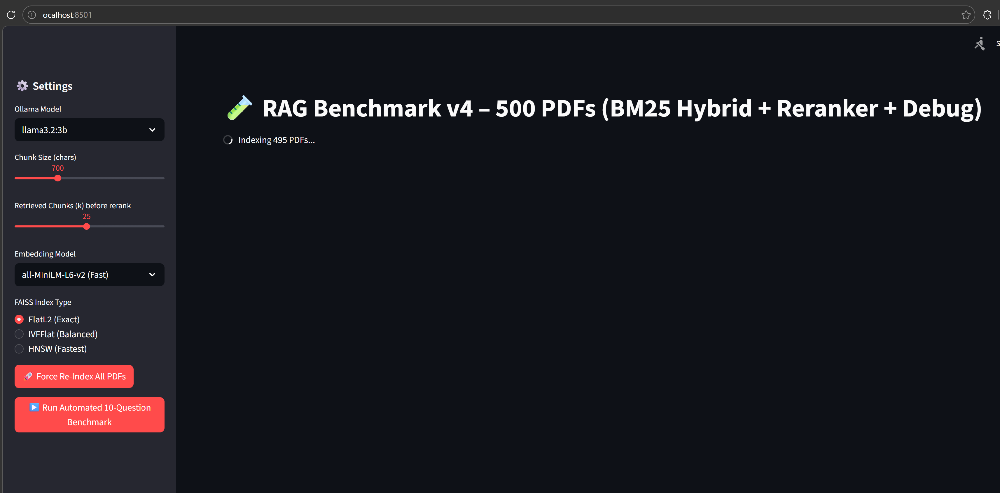

# RAG Local LLM Benchmark Tool

**Built in:** 2026  
**Category:** AI / Machine Learning  
**Technology:** Python + Streamlit

### Description
A fully local Retrieval-Augmented Generation (RAG) application built from scratch to experiment with document-based question answering using open-source tools only.

The system allows users to upload multiple PDF files (especially those containing structured tabular data), then ask both simple retrieval and complex reasoning questions against the documents — all running locally.

### Key Features
- Local LLM inference using Ollama
- FAISS vector database for fast similarity search
- Hybrid retrieval pipeline (BM25 keyword search + vector embeddings)
- Cross-encoder reranker for improved result relevance
- Configurable parameters: chunk size, number of retrieved chunks (k), embedding models
- Automated benchmarking mode with latency tracking and result logging
- Detailed debug output showing exactly which chunks were retrieved for each question

### Tech Stack
- **LLM**: Ollama
- **Embeddings**: Sentence-Transformers
- **Vector Store**: FAISS
- **Hybrid Search**: BM25Okapi + CrossEncoder reranker
- **UI**: Streamlit

### Purpose of This Project
This was my **first major hands-on AI project** after starting to learn AI from scratch.
I used this project to deeply understand the inner workings of RAG systems by running **8+ controlled experiments**.

### Key Learnings
This project gave me hands-on experience with the practical realities of building RAG systems. Through 8+ controlled experiments, I systematically explored:

- Different chunking strategies (400 to 1500 characters)
- Retrieved chunks (k = 6 to 25)
- Embedding models (all-MiniLM-L6-v2, nomic-embed-text-v1.5, and considered BGE models)
- Retrieval techniques (simple vector search → keyword filtering → full BM25 hybrid + cross-encoder reranker)
- FAISS index types (stuck with FlatL2 for accuracy, while being aware of IVFFlat and HNSW approximate methods)

### Screenshots

**Important Realization:**
Even after implementing hybrid retrieval, reranking, and testing multiple embeddings and configurations, classic RAG still showed clear limitations when dealing with structured tabular data and aggregation tasks. 

I consciously chose not to exhaustively test every available option (such as the third embedding model or switching to IVFFlat/HNSW index types) because I recognized that the core issue was architectural — not something that could be fully solved by further parameter tuning or switching vector store components. This helped me understand when RAG is effective and when a hybrid approach with structured tools (like SQL or Pandas) becomes necessary.

### Files
Main implementation: `src/rag_benchmark_final.py`
