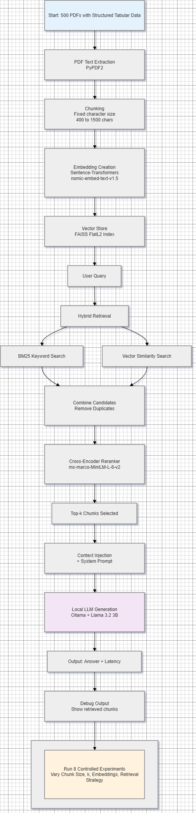

# RAG Local LLM Benchmark Tool

**Built in:** 2026  
**Category:** AI / Machine Learning  
**Technology:** Python + Streamlit

### Description
A fully local Retrieval-Augmented Generation (RAG) application I built from scratch to experiment with document-based question answering using open-source tools. The system allows uploading multiple PDF files containing structured tabular data, then asking both retrieval-style questions (e.g. totals, sums) and reasoning questions about patterns and trends — all running completely locally.

### Key Features Implemented
- Local LLM inference via Ollama
- FAISS vector store for similarity search
- Hybrid retrieval: BM25 keyword search + vector embeddings
- Cross-encoder reranker for improved relevance ranking
- Configurable chunk size and number of retrieved chunks (k)
- Automated benchmarking with per-question latency tracking
- Detailed debug output showing top retrieved chunks for every question
- Streamlit-based interactive UI

### Tech Stack
- **LLM Runtime**: Ollama (I primarily used `Llama 3.2 3B`)
- **Embeddings**: Sentence-Transformers (primarily `nomic-ai/nomic-embed-text-v1.5`)
- **Vector Database**: FAISS (FlatL2 index – exact search)
- **Hybrid Search**: BM25Okapi + CrossEncoder (`ms-marco-MiniLM-L-6-v2`)
- **UI & Benchmarking**: Streamlit

### What I Explored (8 Experiments)
I ran 8 controlled experiments with deliberate progression:

- **Experiments 1–3**: Started with basic vector search while experimenting with different chunk sizes and k values to understand how chunking affects retrieval.
- **Experiments 4–5**: Switched to a stronger embedding model (`nomic-embed-text-v1.5`) and added basic keyword filtering because the initial embeddings were too weak on exact matches.
- **Experiments 6–7**: Implemented full BM25 hybrid retrieval (keyword + vector) + cross-encoder reranker and added detailed debug output to see exactly which chunks were being retrieved.
- **Experiment 8 (Final)**: Optimized chunk size to 800 characters and k=25 with the strongest hybrid setup to push classic RAG as far as possible.

### Key Learnings
This project gave me hands-on experience with the practical realities of building RAG systems. Through 8+ controlled experiments, I systematically explored:

- Different chunking strategies (400 to 1500 characters)
- Retrieved chunks (k = 6 to 25)
- Embedding models (all-MiniLM-L6-v2, nomic-embed-text-v1.5, and considered BGE models)
- Retrieval techniques (simple vector search → keyword filtering → full BM25 hybrid + cross-encoder reranker)
- FAISS index types (stuck with FlatL2 for accuracy, while being aware of IVFFlat and HNSW approximate methods)

### Screenshots

### Flowchart

### Files
Main implementation: `src/rag_benchmark_auto4.py`

**Important Realization:**
Even after implementing hybrid retrieval, reranking, and testing multiple embeddings and configurations, classic RAG still showed clear limitations when dealing with structured tabular data and aggregation tasks. 

I consciously chose not to exhaustively test every available option (such as the third embedding model `bge-small-en-v1.5` or switching to `IVFFlat/HNSW` index types of FAISS) because I recognized that the core issue was architectural — not something that could be fully solved by further parameter tuning or switching vector store components. This helped me understand when RAG is effective and when a hybrid approach with structured tools (like SQL or Pandas) becomes necessary.
